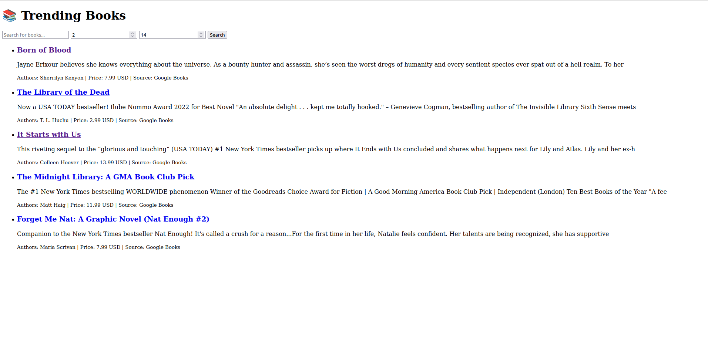
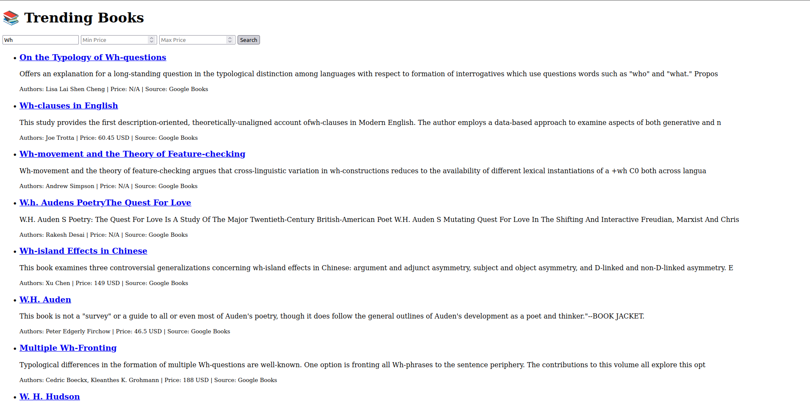

# 📚 Smart Data Display – Trending Books (Flask API)

A web application that fetches trending books using the **Google Books API**, including price information, and provides a searchable and filterable Flask-powered API with a clean frontend.

---

## 🚀 Features

- 🧠 Uses **Google Books API** to fetch book data with price information.
- 🔎 **Search** functionality: `/api/books/search?q=...&max_results=...`.
- 💲 **Price filtering**: `min_price` and `max_price` query parameters to narrow results by price.
- 📦 Well-structured Flask application with modular code.
- 💅 Responsive frontend built with HTML, CSS, and JavaScript.

---

## 📁 Project Structure

```
smart-books-display/
├── app.py                 # Flask application and routes
├── book_fetcher.py        # Google Books API integration with price data
├── config.py              # API URL and default settings
├── requirements.txt       # Python dependencies
├── templates/
│   └── index.html         # Frontend UI
├── static/
│   └── styles.css         # Frontend styles

```

---

## ⚙️ Setup Instructions

### 1. Clone the repository
```bash
git clone https://github.com/your-username/smart-books-display.git](https://github.com/shubham9345/Assignment-Maketronics
cd Assignment-Maketronics
```

### 2. (Optional) Create & activate a virtual environment
```bash
python -m venv venv
source venv/bin/activate  # Linux/macOS
venv\Scripts\activate     # Windows
```

### 3. Install dependencies
```bash
pip install -r requirements.txt
```

### 4. Run the application
```bash
python app.py
```

Open [http://localhost:5000](http://localhost:5000) in your browser.

---

## 🔌 API Endpoints

### `GET /api/books`
Returns the default list of trending books with price and currency.

### `GET /api/books/search`
Search and filter books.

- **Parameters**:
  - `q` (string, optional): Search term (defaults to "trending books").
  - `max_results` (int, optional): Number of results to fetch (defaults to 15).
  - `min_price` (float, optional): Minimum price filter (inclusive).
  - `max_price` (float, optional): Maximum price filter (inclusive).

- **Example**:
  ```
  GET /api/books/search?q=python&min_price=10&max_price=50
  ```
## 🛠️ Technologies Used

- **Python 3**
- **Flask** & **Flask-CORS**
- **Requests** for HTTP calls
- **Google Books API**
- **HTML**, **CSS**, **JavaScript**

---

## 📸 Frontend Screenshots







---

## 💡 Future Improvements

- Implement **pagination** for large result sets.
- Persist cache in **Redis** or a file for resilience.
- Add **sorting** by price, author, or relevance.
- Show more metadata: ratings, published date, cover images.

---

## 📝 License

MIT License

---

## 👤 Author
**Shubham Kumar** – [GitHub](https://github.com/your-username)
